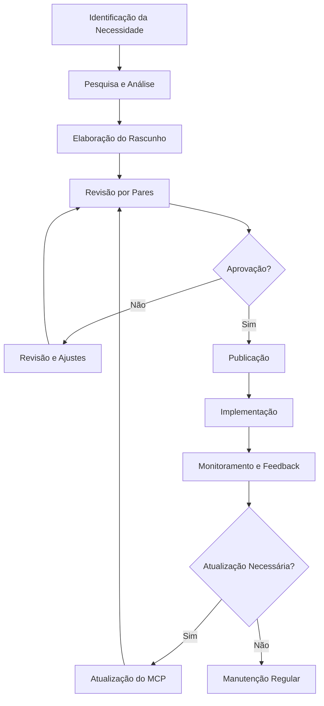

# Guia de Implementação de Model Context Protocol (MCP)

## 1. Introdução aos Model Context Protocols

### 1.1 O que são MCPs?

Os Model Context Protocols (MCPs) são documentos estruturados que definem padrões, processos e melhores práticas para diferentes aspectos do Sistema TEKTRIO. Eles servem como guias de referência que garantem consistência, qualidade e eficiência em todo o ciclo de desenvolvimento e operação do sistema.

### 1.2 Importância dos MCPs

Os MCPs são fundamentais para o Sistema TEKTRIO pelos seguintes motivos:

- **Padronização**: Estabelecem padrões consistentes em todas as camadas do sistema
- **Qualidade**: Garantem que todos os componentes sigam as melhores práticas
- **Eficiência**: Reduzem o tempo de tomada de decisão e implementação
- **Comunicação**: Facilitam a comunicação entre diferentes equipes e agentes
- **Escalabilidade**: Permitem que o sistema cresça de forma organizada e sustentável
- **Manutenção**: Simplificam a manutenção e evolução do sistema ao longo do tempo

### 1.3 Categorias de MCPs

O Sistema TEKTRIO utiliza quatro categorias principais de MCPs:

1. **MCPs de Desenvolvimento**: Focados em padrões de código, arquitetura e implementação
2. **MCPs de Documentação**: Estabelecem padrões para documentação técnica, de API e de usuário
3. **MCPs de Testes**: Definem processos e padrões para diferentes tipos de testes
4. **MCPs de Operações**: Cobrem aspectos de deploy, monitoramento e manutenção

## 2. Estrutura Padrão de um MCP

Cada MCP deve seguir uma estrutura padronizada para garantir consistência e facilidade de uso:

```
# MCP-[CATEGORIA]-[NÚMERO]: [TÍTULO]

## 1. Resumo
[Breve descrição do propósito e escopo do MCP em 2-3 parágrafos]

## 2. Motivação
[Explicação de por que este MCP é necessário e quais problemas ele resolve]

## 3. Especificação
[Detalhamento completo do protocolo, incluindo regras, padrões e processos]

## 4. Implementação
[Guia passo a passo para implementar o protocolo]

## 5. Exemplos
[Exemplos práticos de aplicação do protocolo]

## 6. Considerações
[Discussão de casos especiais, limitações e alternativas]

## 7. Referências
[Fontes, documentos relacionados e leituras adicionais]

## 8. Metadados
- **Autor**: [Nome do autor]
- **Versão**: [Número da versão]
- **Data de Criação**: [Data]
- **Última Atualização**: [Data]
- **Status**: [Rascunho/Em Revisão/Aprovado/Obsoleto]
- **Aprovado por**: [Nome do aprovador]
```

## 3. Processo de Criação de MCPs

### 3.1 Fluxo de Trabalho para Criação de MCPs



### 3.2 Passos Detalhados para Criação de MCPs

#### Passo 1: Identificação da Necessidade
1. Identifique uma área que necessita de padronização ou melhoria
2. Consulte a documentação existente para verificar se já existe um MCP relacionado
3. Discuta com stakeholders relevantes para validar a necessidade
4. Defina claramente o escopo e objetivos do MCP

#### Passo 2: Pesquisa e Análise
1. Pesquise as melhores práticas da indústria relacionadas ao tema
2. Analise como o problema é tratado em outros sistemas similares
3. Identifique requisitos específicos do Sistema TEKTRIO
4. Colete feedback de especialistas na área

#### Passo 3: Elaboração do Rascunho
1. Crie um novo arquivo seguindo a estrutura padrão de MCP
2. Preencha cada seção com conteúdo relevante e detalhado
3. Inclua exemplos práticos e casos de uso
4. Documente claramente as regras e processos

#### Passo 4: Revisão por Pares
1. Compartilhe o rascunho com pelo menos dois revisores
2. Solicite feedback específico sobre clareza, completude e aplicabilidade
3. Realize uma reunião de revisão para discutir pontos críticos
4. Documente todos os comentários e sugestões

#### Passo 5: Revisão e Ajustes
1. Incorpore o feedback recebido durante a revisão
2. Refine a linguagem e estrutura do documento
3. Adicione exemplos adicionais se necessário
4. Verifique a consistência com outros MCPs existentes

#### Passo 6: Aprovação
1. Submeta o MCP revisado para aprovação formal
2. O Agente Especialista Modular deve revisar e aprovar todos os MCPs
3. Para MCPs críticos, o Agente Supervisor Geral também deve aprovar
4. Documente a aprovação nos metadados do MCP

#### Passo 7: Publicação
1. Atribua um número único ao MCP aprovado
2. Atualize o status para "Aprovado" nos metadados
3. Publique o MCP no repositório central de documentação
4. Anuncie a publicação para todas as partes interessadas

#### Passo 8: Implementação
1. Desenvolva um plano de implementação para o MCP
2. Comunique as novas diretrizes a todos os afetados
3. Forneça treinamento ou orientação conforme necessário
4. Estabeleça um cronograma para conformidade

#### Passo 9: Monitoramento e Feedback
1. Monitore a adoção e eficácia do MCP
2. Colete feedback contínuo dos usuários
3. Identifique áreas de melhoria ou clarificação
4. Documente lições aprendidas

#### Passo 10: Manutenção e Atualização
1. Revise periodicamente o MCP (pelo menos a cada 6 meses)
2. Atualize conforme necessário para refletir mudanças no sistema
3. Mantenha um histórico de versões com alterações documentadas
4. Comunique atualizações significativas a todas as partes interessadas

## 4. Templates para Cada Categoria de MCP

### 4.1 Template para MCP de Desenvolvimento

```markdown
# MCP-DEV-[NÚMERO]: [TÍTULO]

## 1. Resumo
[Breve descrição do padrão de desenvolvimento]

## 2. Motivação
[Por que este padrão de desenvolvimento é necessário]

## 3. Especificação
### 3.1 Padrões de Código
[Detalhes sobre convenções de codificação]

### 3.2 Arquitetura
[Princípios arquiteturais e padrões de design]

### 3.3 Ferramentas e Tecnologias
[Ferramentas e tecnologias recomendadas]

## 4. Implementação
[Guia passo a passo para implementar o padrão]

## 5. Exemplos
[Exemplos de código e implementações]

## 6. Considerações
[Casos especiais e limitações]

## 7. Referências
[Fontes e documentos relacionados]

## 8. Metadados
- **Autor**: [Nome]
- **Versão**: [Número]
- **Data de Criação**: [Data]
- **Última Atualização**: [Data]
- **Status**: [Status]
- **Aprovado por**: [Nome]
```

### 4.2 Template para MCP de Documentação

```markdown
# MCP-DOC-[NÚMERO]: [TÍTULO]

## 1. Resumo
[Breve descrição do padrão de documentação]

## 2. Motivação
[Por que este padrão de documentação é necessário]

## 3. Especificação
### 3.1 Estrutura do Documento
[Detalhes sobre a estrutura e organização]

### 3.2 Estilo e Formatação
[Diretrizes de estilo e formatação]

### 3.3 Ferramentas e Processos
[Ferramentas e processos recomendados]

## 4. Implementação
[Guia passo a passo para criar documentação]

## 5. Exemplos
[Exemplos de documentação bem estruturada]

## 6. Considerações
[Casos especiais e limitações]

## 7. Referências
[Fontes e documentos relacionados]

## 8. Metadados
- **Autor**: [Nome]
- **Versão**: [Número]
- **Data de Criação**: [Data]
- **Última Atualização**: [Data]
- **Status**: [Status]
- **Aprovado por**: [Nome]
```

### 4.3 Template para MCP de Testes

```markdown
# MCP-TEST-[NÚMERO]: [TÍTULO]

## 1. Resumo
[Breve descrição do padrão de testes]

## 2. Motivação
[Por que este padrão de testes é necessário]

## 3. Especificação
### 3.1 Tipos de Testes
[Detalhes sobre os tipos de testes abordados]

### 3.2 Ferramentas e Frameworks
[Ferramentas e frameworks recomendados]

### 3.3 Métricas e Cobertura
[Métricas e níveis de cobertura esperados]

## 4. Implementação
[Guia passo a passo para implementar os testes]

## 5. Exemplos
[Exemplos de testes bem implementados]

## 6. Considerações
[Casos especiais e limitações]

## 7. Referências
[Fontes e documentos relacionados]

## 8. Metadados
- **Autor**: [Nome]
- **Versão**: [Número]
- **Data de Criação**: [Data]
- **Última Atualização**: [Data]
- **Status**: [Status]
- **Aprovado por**: [Nome]
```

### 4.4 Template para MCP de Operações

```markdown
# MCP-OPS-[NÚMERO]: [TÍTULO]

## 1. Resumo
[Breve descrição do padrão operacional]

## 2. Motivação
[Por que este padrão operacional é necessário]

## 3. Especificação
### 3.1 Processos Operacionais
[Detalhes sobre os processos operacionais]

### 3.2 Ferramentas e Infraestrutura
[Ferramentas e infraestrutura recomendadas]

### 3.3 Monitoramento e Alertas
[Estratégias de monitoramento e alertas]

## 4. Implementação
[Guia passo a passo para implementar os processos]

## 5. Exemplos
[Exemplos de operações bem implementadas]

## 6. Considerações
[Casos especiais e limitações]

## 7. Referências
[Fontes e documentos relacionados]

## 8. Metadados
- **Autor**: [Nome]
- **Versão**: [Número]
- **Data de Criação**: [Data]
- **Última Atualização**: [Data]
- **Status**: [Status]
- **Aprovado por**: [Nome]
```

## 5. Exemplos de MCPs Implementados

### 5.1 Exemplo de MCP de Desenvolvimento

```markdown
# MCP-DEV-001: Padrões de Codificação JavaScript/TypeScript

## 1. Resumo
Este MCP define os padrões de codificação para JavaScript e TypeScript no Sistema TEKTRIO. Ele estabelece convenções de nomenclatura, formatação, estrutura de arquivos e práticas recomendadas para garantir código consistente, legível e manutenível em todo o sistema.

## 2. Motivação
A consistência no código é essencial para facilitar a colaboração, reduzir erros e simplificar a manutenção. Com múltiplos desenvolvedores e agentes trabalhando no Sistema TEKTRIO, é crucial ter padrões claros que todos possam seguir. Este MCP visa eliminar debates sobre estilo e permitir que a equipe se concentre na qualidade e funcionalidade do código.

## 3. Especificação
### 3.1 Padrões de Código
#### 3.1.1 Nomenclatura
- **Variáveis e Funções**: camelCase (ex: `getUserData`)
- **Classes**: PascalCase (ex: `UserManager`)
- **Constantes**: UPPER_SNAKE_CASE (ex: `MAX_RETRY_COUNT`)
- **Interfaces**: PascalCase com prefixo I (ex: `IUserData`)
- **Tipos**: PascalCase (ex: `UserType`)
- **Arquivos**: kebab-case (ex: `user-manager.ts`)

#### 3.1.2 Formatação
- Indentação: 2 espaços
- Comprimento máximo de linha: 100 caracteres
- Uso de ponto e vírgula no final das declarações
- Uso de aspas simples para strings
- Espaço após palavras-chave (if, for, while, etc.)
- Espaço antes e depois de operadores (=, +, -, etc.)

#### 3.1.3 Estrutura de Arquivos
- Um componente/classe por arquivo
- Imports agrupados e ordenados: bibliotecas externas primeiro, seguidas por imports internos
- Exports no final do arquivo

### 3.2 Arquitetura
#### 3.2.1 Princípios
- Preferir composição sobre herança
- Seguir princípios SOLID
- Implementar padrões de design apropriados
- Manter componentes pequenos e focados

#### 3.2.2 Organização de Código
- Estrutura de pastas por funcionalidade
- Separação clara entre lógica de negócio e interface do usuário
- Uso de barris (index.ts) para exportações

### 3.3 Ferramentas e Tecnologias
- ESLint para linting
- Prettier para formatação
- TypeScript para tipagem estática
- Jest para testes unitários
- Husky para hooks de pre-commit

## 4. Implementação
1. Configure ESLint e Prettier no projeto:
   ```bash
   npm install --save-dev eslint prettier @typescript-eslint/parser @typescript-eslint/eslint-plugin eslint-config-prettier eslint-plugin-prettier
   ```

2. Crie os arquivos de configuração:
   - `.eslintrc.js`
   - `.prettierrc`

3. Configure o Husky para verificar o código antes de commits:
   ```bash
   npm install --save-dev husky lint-staged
   ```

4. Adicione scripts no package.json:
   ```json
   "scripts": {
     "lint": "eslint 'src/**/*.{js,ts,tsx}'",
     "format": "prettier --write 'src/**/*.{js,ts,tsx}'",
     "prepare": "husky install"
   }
   ```

5. Integre com o Cursor IDE:
   - Configure o Cursor para usar ESLint e Prettier
   - Habilite formatação automática ao salvar

## 5. Exemplos
### 5.1 Exemplo de Código Bem Formatado
```typescript
// Constantes
const MAX_RETRY_COUNT = 3;

// Interface
interface IUserData {
  id: string;
  name: string;
  email: string;
  isActive: boolean;
}

// Classe
class UserManager {
  private users: IUserData[] = [];

  constructor(initialUsers: IUserData[] = []) {
    this.users = initialUsers;
  }

  public getUserById(id: string): IUserData | undefined {
    return this.users.find((user) => user.id === id);
  }

  public addUser(userData: Omit<IUserData, 'id'>): IUserData {
    const newUser = {
      id: this.generateId(),
      ...userData,
    };
    
    this.users.push(newUser);
    return newUser;
  }

  private generateId(): string {
    return Math.random().toString(36).substring(2, 9);
  }
}

// Função
function formatUserName(user: IUserData): string {
  return user.name.toUpperCase();
}

export { UserManager, formatUserName };
export type { IUserData };
```

## 6. Considerações
- Estes padrões devem ser aplicados a todo novo código, mas a refatoração de código legado pode ser gradual
- Em casos excepcionais onde os padrões não podem ser seguidos, documentar a razão com comentários
- Revisões de código devem verificar a conformidade com estes padrões

## 7. Referências
- [Airbnb JavaScript Style Guide](https://github.com/airbnb/javascript)
- [Google TypeScript Style Guide](https://google.github.io/styleguide/tsguide.html)
- [TypeScript Documentation](https://www.typescriptlang.org/docs/)
- [ESLint Documentation](https://eslint.org/docs/user-guide/)
- [Prettier Documentation](https://prettier.io/docs/en/)

## 8. Metadados
- **Autor**: Equipe TEKTRIO
- **Versão**: 1.0.0
- **Data de Criação**: 07/04/2025
- **Última Atualização**: 07/04/2025
- **Status**: Aprovado
- **Aprovado por**: Agente Especialista Modular
```

### 5.2 Exemplo de MCP de Operações

```markdown
# MCP-OPS-001: Processo de Deploy e Rollback

## 1. Resumo
Este MCP define o processo padrão para deploy e rollback de aplicações no Sistema TEKTRIO. Ele estabelece os passos, ferramentas, verificações e procedimentos de emergência para garantir deploys seguros e confiáveis em todos os ambientes.

## 2. Motivação
Deploys consistentes e confiáveis são essenciais para manter a estabilidade e disponibilidade do Sistema TEKTRIO. Um processo bem definido reduz o risco de falhas, minimiza o tempo de inatividade e permite recuperação rápida em caso de problemas. Este MCP visa padronizar o processo de deploy em todas as camadas do sistema.

## 3. Especificação
### 3.1 Processos Operacionais
#### 3.1.1 Fluxo de Deploy
1. **Preparação**
   - Verificação de pré-requisitos
   - Criação de tag de versão
   - Geração de changelog

2. **Validação**
   - Execução de testes automatizados
   - Verificação de qualidade de código
   - Validação de segurança

3. **Deploy em Staging**
   - Deploy em ambiente de staging
   - Testes de smoke
   - Validação de funcionalidades críticas

4. **Aprovação**
   - Revisão dos resultados de testes
   - Aprovação formal para produção
   - Agendamento do deploy

5. **Deploy em Produção**
   - Notificação de stakeholders
   - Execução do deploy
   - Verificações pós-deploy

6. **Monitoramento**
   - Monitoramento intensivo por 1 hora
   - Verificação de métricas de performance
   - Monitoramento de logs de erro

#### 3.1.2 Processo de Rollback
1. **Critérios para Rollback**
   - Falhas críticas que afetam usuários
   - Degradação significativa de performance
   - Problemas de segurança identificados

2. **Procedimento de Rollback**
   - Decisão de rollback (quem pode autorizar)
   - Execução do rollback para versão anterior
   - Notificação de stakeholders

3. **Pós-Rollback**
   - Análise de causa raiz
   - Documentação do incidente
   - Plano de correção

### 3.2 Ferramentas e Infraestrutura
- CI/CD: GitHub Actions
- Orquestração: Docker Compose e Kubernetes
- Monitoramento: Prometheus e Grafana
- Logs: ELK Stack (Elasticsearch, Logstash, Kibana)
- Notificações: Slack e Email

### 3.3 Monitoramento e Alertas
- Monitoramento de disponibilidade (uptime)
- Monitoramento de performance (latência, throughput)
- Monitoramento de recursos (CPU, memória, disco)
- Alertas para limiares críticos
- Dashboards para visualização em tempo real

## 4. Implementação
1. Configure o pipeline de CI/CD:
   ```yaml
   # .github/workflows/deploy.yml
   name: Deploy
   
   on:
     push:
       tags:
         - 'v*'
   
   jobs:
     build:
       runs-on: ubuntu-latest
       steps:
         - uses: actions/checkout@v2
         - name: Build and Test
           run: |
             npm ci
             npm run build
             npm test
         # ... mais passos
   ```

2. Implemente scripts de deploy:
   ```bash
   #!/bin/bash
   # deploy.sh
   
   set -e
   
   echo "Iniciando deploy da versão $VERSION"
   
   # Verificações pré-deploy
   ./scripts/pre-deploy-checks.sh
   
   # Deploy
   kubectl apply -f k8s/deployment.yaml
   
   # Verificações pós-deploy
   ./scripts/post-deploy-checks.sh
   
   echo "Deploy concluído com sucesso"
   ```

3. Crie script de rollback:
   ```bash
   #!/bin/bash
   # rollback.sh
   
   set -e
   
   PREVIOUS_VERSION=$1
   
   echo "Iniciando rollback para versão $PREVIOUS_VERSION"
   
   # Rollback
   kubectl rollout undo deployment/app-deployment
   
   # Verificações pós-rollback
   ./scripts/post-deploy-checks.sh
   
   echo "Rollback concluído com sucesso"
   ```

4. Configure monitoramento:
   - Instale Prometheus e Grafana
   - Configure dashboards para métricas críticas
   - Configure alertas para condições de falha

5. Documente o processo para a equipe:
   - Crie wiki com instruções detalhadas
   - Treine a equipe no processo
   - Realize simulações de deploy e rollback

## 5. Exemplos
### 5.1 Exemplo de Checklist de Deploy
```markdown
# Checklist de Deploy

## Pré-Deploy
- [ ] Todos os testes passaram no CI
- [ ] Code review foi aprovado
- [ ] Changelog foi gerado
- [ ] Tag de versão foi criada
- [ ] Stakeholders foram notificados

## Durante o Deploy
- [ ] Backup do estado atual foi criado
- [ ] Deploy foi executado em staging
- [ ] Testes de smoke passaram em staging
- [ ] Deploy foi aprovado para produção
- [ ] Deploy foi executado em produção

## Pós-Deploy
- [ ] Verificações de saúde passaram
- [ ] Métricas de performance estão normais
- [ ] Não há erros nos logs
- [ ] Funcionalidades críticas foram validadas
- [ ] Documentação foi atualizada
```

## 6. Considerações
- O processo deve ser adaptado para diferentes tipos de aplicações (frontend, backend, microserviços)
- Deploys críticos devem ser agendados para períodos de baixo tráfego
- Mantenha um registro de todos os deploys e rollbacks para análise histórica
- Revise e melhore o processo regularmente com base em lições aprendidas

## 7. Referências
- [GitHub Actions Documentation](https://docs.github.com/en/actions)
- [Kubernetes Deployment Strategies](https://kubernetes.io/docs/concepts/workloads/controllers/deployment/)
- [Prometheus Documentation](https://prometheus.io/docs/introduction/overview/)
- [Site Reliability Engineering (Google)](https://sre.google/sre-book/table-of-contents/)

## 8. Metadados
- **Autor**: Equipe TEKTRIO
- **Versão**: 1.0.0
- **Data de Criação**: 07/04/2025
- **Última Atualização**: 07/04/2025
- **Status**: Aprovado
- **Aprovado por**: Agente Supervisor Geral
```

## 6. Integração de MCPs no Fluxo de Trabalho

### 6.1 Ciclo de Vida dos MCPs

Os MCPs seguem um ciclo de vida definido:

1. **Rascunho**: Versão inicial em desenvolvimento
2. **Em Revisão**: Submetido para revisão por pares
3. **Aprovado**: Oficialmente aprovado e publicado
4. **Implementado**: Adotado e em uso no sistema
5. **Em Atualização**: Sendo revisado para nova versão
6. **Obsoleto**: Substituído ou não mais relevante

### 6.2 Integração com Ferramentas de Desenvolvimento

- **Repositório Git**: MCPs são armazenados em um repositório Git dedicado
- **Sistema de Issues**: Rastreamento de propostas e atualizações de MCPs
- **Pull Requests**: Processo de revisão e aprovação
- **CI/CD**: Verificação automática de formatação e links
- **Wiki**: Publicação de MCPs aprovados para fácil acesso

### 6.3 Conformidade e Auditoria

- Revisões de código verificam conformidade com MCPs relevantes
- Auditorias periódicas avaliam a adoção dos MCPs
- Métricas de conformidade são coletadas e reportadas
- Desvios dos MCPs devem ser documentados e justificados

## 7. Conclusão

Os Model Context Protocols são uma parte essencial do Sistema TEKTRIO, fornecendo estrutura, padronização e direção para todos os aspectos do desenvolvimento e operação. Seguindo o processo definido neste guia, você pode criar MCPs eficazes que melhoram a qualidade, consistência e eficiência do sistema.

Lembre-se de que os MCPs são documentos vivos que devem evoluir com o sistema. Revisões e atualizações regulares são essenciais para manter sua relevância e utilidade.

## 8. Metadados
- **Autor**: Equipe TEKTRIO
- **Versão**: 1.0.0
- **Data de Criação**: 07/04/2025
- **Última Atualização**: 07/04/2025
- **Status**: Aprovado
- **Aprovado por**: Agente Supervisor Geral