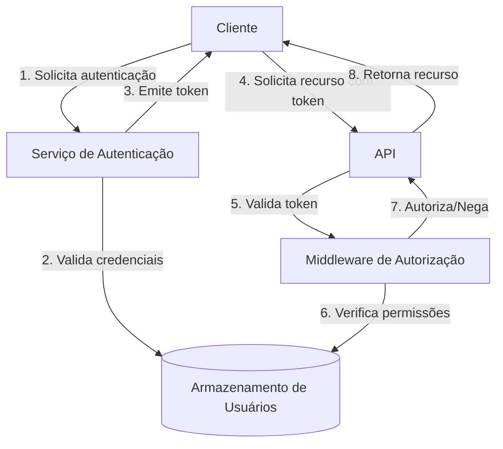

# Template para MCP de Documentação

Este documento fornece um template padronizado para a criação de Model Context Protocols (MCPs) na categoria de Documentação. Use este template como base para criar novos MCPs relacionados a padrões de documentação técnica, de API e de usuário.

## Estrutura do Template

```markdown
# MCP-DOC-[NÚMERO]: [TÍTULO]

## 1. Resumo
[Breve descrição do padrão de documentação]

## 2. Motivação
[Por que este padrão de documentação é necessário]

## 3. Especificação
### 3.1 Estrutura do Documento
[Detalhes sobre a estrutura e organização]

### 3.2 Estilo e Formatação
[Diretrizes de estilo e formatação]

### 3.3 Ferramentas e Processos
[Ferramentas e processos recomendados]

## 4. Implementação
[Guia passo a passo para criar documentação]

## 5. Exemplos
[Exemplos de documentação bem estruturada]

## 6. Considerações
[Casos especiais e limitações]

## 7. Referências
[Fontes e documentos relacionados]

## 8. Metadados
- **Autor**: [Nome]
- **Versão**: [Número]
- **Data de Criação**: [Data]
- **Última Atualização**: [Data]
- **Status**: [Status]
- **Aprovado por**: [Nome]
```

## Instruções de Uso

1. Copie o template acima para um novo arquivo
2. Substitua os campos entre colchetes com o conteúdo apropriado
3. Atribua um número sequencial único para o MCP
4. Preencha todas as seções com detalhes relevantes
5. Inclua exemplos práticos e casos de uso
6. Submeta para revisão seguindo o processo definido no Guia de Implementação de MCPs

## Exemplo de MCP de Documentação

```markdown
# MCP-DOC-001: Padrões para Documentação Técnica

## 1. Resumo
Este MCP define os padrões para documentação técnica no Sistema TEKTRIO. Ele estabelece diretrizes para estrutura, formatação, estilo de escrita e ferramentas para garantir documentação consistente, clara e útil em todo o sistema.

## 2. Motivação
Documentação técnica de alta qualidade é essencial para facilitar o desenvolvimento, manutenção e evolução do Sistema TEKTRIO. Com múltiplos desenvolvedores e agentes contribuindo para a documentação, é crucial ter padrões claros que todos possam seguir. Este MCP visa eliminar inconsistências e garantir que toda documentação seja acessível, precisa e útil.

## 3. Especificação
### 3.1 Estrutura do Documento
#### 3.1.1 Hierarquia de Documentação
- **Documentação de Nível 1**: Visão geral do sistema e arquitetura
- **Documentação de Nível 2**: Documentação de módulos e componentes
- **Documentação de Nível 3**: Documentação de classes e funções
- **Documentação de Nível 4**: Guias e tutoriais

#### 3.1.2 Estrutura de Documentos Técnicos
- **Título**: Claro e descritivo
- **Resumo**: Breve descrição do conteúdo (2-3 parágrafos)
- **Introdução**: Contexto e propósito
- **Corpo Principal**: Conteúdo detalhado, organizado em seções lógicas
- **Conclusão**: Resumo dos pontos principais
- **Referências**: Fontes e documentos relacionados
- **Metadados**: Autor, versão, datas, status

### 3.2 Estilo e Formatação
#### 3.2.1 Estilo de Escrita
- Use voz ativa e tempo presente
- Seja conciso e direto
- Use linguagem técnica apropriada, mas evite jargão desnecessário
- Defina termos técnicos na primeira ocorrência
- Use listas e tabelas para informações estruturadas
- Inclua exemplos para conceitos complexos

#### 3.2.2 Formatação
- Use Markdown para toda documentação técnica
- Siga a hierarquia de cabeçalhos (# para título, ## para seções principais, etc.)
- Limite o comprimento das linhas a 100 caracteres
- Use blocos de código com destaque de sintaxe para exemplos de código
- Use links internos para referências cruzadas
- Use imagens e diagramas quando apropriado

### 3.3 Ferramentas e Processos
- **Repositório**: GitHub para armazenamento e versionamento
- **Renderização**: MkDocs para geração de documentação HTML
- **Diagramas**: Mermaid para diagramas integrados ao Markdown
- **Revisão**: Pull Requests para revisão por pares
- **Publicação**: CI/CD para publicação automática

## 4. Implementação
1. Configure o ambiente de documentação:
   ```bash
   pip install mkdocs mkdocs-material
   mkdocs new my-project
   cd my-project
   ```

2. Estruture o diretório de documentação:
   ```
   docs/
   ├── index.md
   ├── architecture/
   │   ├── overview.md
   │   └── components.md
   ├── modules/
   │   ├── module1.md
   │   └── module2.md
   ├── api/
   │   ├── endpoints.md
   │   └── models.md
   └── guides/
       ├── getting-started.md
       └── troubleshooting.md
   ```

3. Configure o mkdocs.yml:
   ```yaml
   site_name: Documentação TEKTRIO
   theme:
     name: material
   markdown_extensions:
     - pymdownx.highlight
     - pymdownx.superfences:
         custom_fences:
           - name: mermaid
             class: mermaid
             format: !!python/name:pymdownx.superfences.fence_code_format
   ```

4. Integre com o fluxo de trabalho:
   - Configure GitHub Actions para build e deploy
   - Estabeleça processo de revisão por pares
   - Implemente verificações automáticas de qualidade

## 5. Exemplos
### 5.1 Exemplo de Documentação Bem Estruturada

```markdown
# Sistema de Autenticação

## Resumo
O Sistema de Autenticação do TEKTRIO gerencia a autenticação e autorização de usuários em toda a plataforma. Este documento descreve a arquitetura, componentes e fluxos de autenticação.

## Introdução
A autenticação segura é fundamental para proteger os dados dos usuários e garantir que apenas usuários autorizados acessem recursos específicos. O Sistema de Autenticação do TEKTRIO implementa OAuth 2.0 e JWT para fornecer autenticação robusta e flexível.

## Arquitetura
O sistema consiste em três componentes principais:
1. **Serviço de Autenticação**: Gerencia credenciais e emite tokens
2. **Middleware de Autorização**: Valida tokens e aplica políticas de acesso
3. **Armazenamento de Usuários**: Mantém dados de usuários e permissões

### Diagrama de Arquitetura



## Fluxos de Autenticação
### Login com Credenciais
1. O usuário fornece nome de usuário e senha
2. O sistema valida as credenciais
3. Se válidas, o sistema emite um token JWT
4. O token é retornado ao cliente

### Código de Exemplo
```typescript
async function login(username: string, password: string): Promise<string> {
  const user = await userRepository.findByUsername(username);
  
  if (!user || !await bcrypt.compare(password, user.passwordHash)) {
    throw new AuthenticationError('Credenciais inválidas');
  }
  
  const token = jwt.sign(
    { sub: user.id, roles: user.roles },
    process.env.JWT_SECRET,
    { expiresIn: '1h' }
  );
  
  return token;
}
```

## Considerações de Segurança
- Tokens expiram após 1 hora
- Senhas são armazenadas com hash usando bcrypt
- HTTPS é obrigatório para todas as comunicações
- Implementamos proteção contra ataques de força bruta

## Referências
- [OAuth 2.0 Specification](https://oauth.net/2/)
- [JWT Introduction](https://jwt.io/introduction)
- [OWASP Authentication Best Practices](https://owasp.org/www-project-web-security-testing-guide/latest/4-Web_Application_Security_Testing/04-Authentication_Testing/README)
```

## 6. Considerações
- Estes padrões devem ser aplicados a toda nova documentação, mas a atualização de documentação legada pode ser gradual
- A documentação deve ser tratada como código, com revisões, testes e manutenção regular
- Considere a audiência ao escrever - diferentes níveis de detalhe podem ser necessários para diferentes públicos

## 7. Referências
- [Google Developer Documentation Style Guide](https://developers.google.com/style)
- [Microsoft Writing Style Guide](https://docs.microsoft.com/en-us/style-guide/welcome/)
- [MkDocs Documentation](https://www.mkdocs.org/)
- [Markdown Guide](https://www.markdownguide.org/)

## 8. Metadados
- **Autor**: Equipe TEKTRIO
- **Versão**: 1.0.0
- **Data de Criação**: 07/04/2025
- **Última Atualização**: 07/04/2025
- **Status**: Aprovado
- **Aprovado por**: Agente Especialista Modular
```

## Dicas para Criação de MCPs de Documentação Eficazes

1. **Foque na usabilidade**: A documentação existe para ser usada; priorize a experiência do leitor
2. **Seja consistente**: Mantenha consistência em terminologia, estilo e formato
3. **Mantenha atualizado**: Documentação desatualizada é pior que nenhuma documentação
4. **Use exemplos reais**: Exemplos concretos ajudam na compreensão
5. **Considere o contexto**: Adapte as recomendações ao contexto específico do Sistema TEKTRIO

## Próximos Passos

Após criar um MCP de Documentação usando este template:

1. Submeta para revisão por pares
2. Incorpore o feedback recebido
3. Obtenha aprovação formal
4. Publique no repositório de documentação
5. Comunique à equipe
6. Monitore a adoção e eficácia
7. Atualize conforme necessário